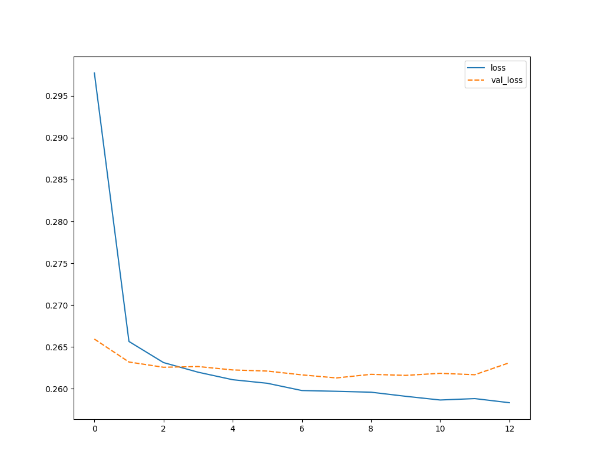

# Lending Model 🤖

> Model that predicts if a customer is eligible for a lending based on dti, loan amount, mortgage accounts and more.

## Goals

The goal with this model is to be able to predict if a customer is eligible for a lending or not. The data set used to train the model got too many examples of customers that fully paid the lending than the ones charged off. Our goal is to explore the maximum potential of our data set to be able to create a good train/test data for our model, leading it to has a better accuracy in both cases.

## Results

Over fitting train test data:



### Confusion matrix

```shell
[[ 6941  8717]
 [  179 63207]]
```

### Classification report

```shell
              precision    recall  f1-score   support

           0       0.97      0.44      0.61     15658
           1       0.88      1.00      0.93     63386

    accuracy                           0.89     79044
   macro avg       0.93      0.72      0.77     79044
weighted avg       0.90      0.89      0.87     79044
```

## Exploratory data analysis

Count fully paid and charged off loans:


Count loan sub grades by loan status:


Correlation between all fields:


Correlation between installment and loan amount:


Correlation between loan repaid and other fields:


Correlation between loan status and loan amount:


Historic of loans by loan amount:


## Running

To run the model first create a new Python environment and activate it. I'm using [Anaconda](https://www.anaconda.com/) for that. The command bellow will automatically setup the environment with conda and pipenv:

```shell
make env
```

Now install all the project dependencies:

```shell
make install-all
```

And run the model:

```shell
make model
```

> [!WARNING]
> Dont run `make model` without deleting `storage/lending-model.keras`, this will
> cause train/test data over fitting.

After running you model, it will be saved inside `storage/lending-model.keras`.
To just run your recent created model and predict a random value from our data set,
use the following script:

```shell
make predict 
```

> [!WARNING]
> In case you have deleted the `storage/lending-model.keras`, remember that to get `make predict` working you need to run `make model` first to create it.

To run TensorBoard with the latest created version of the model within this
repository run:

```shell
make board
```
